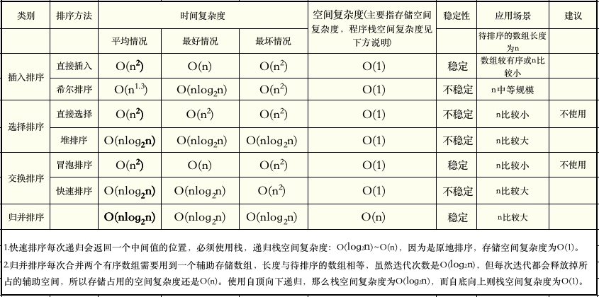

## 常见类型
**主要会学到以下7种排序算法** 

1.插入类排序有：直接插入排序和希尔排序

2.选择类排序有：直接选择排序和堆排序

3.交换类排序有：冒泡排序和快速排序

4.归并排序

我们把冒泡排序，直接选择排序，直接插入排序认为是初级的排序算法

一般建议待排序数组为小规模情况下使用直接插入排序，在规模中等的情况下可以使用希尔排序，但在大规模还是要使用快速排序，归并排序或堆排序。

保持稳定性： 冒泡排序、直接插入、归并排序
不保持稳定性： 希尔排序、直接选择、堆排序、快速排序

